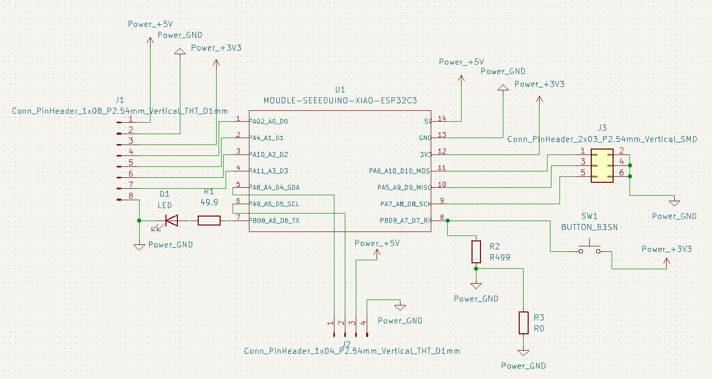
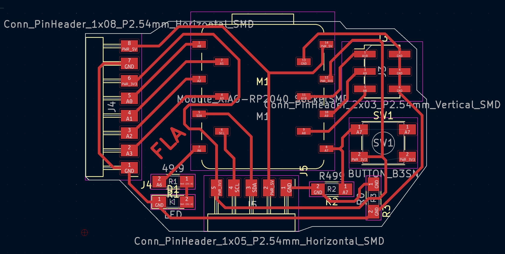

# fla-xiao

KiCad útgáfa byggð á [fabxiao](https://fabacademy.org/2020/labs/leon/students/adrian-torres/fabxiao.html) eftir meistara [Adrián Torres](https://fabacademy.org/2020/labs/leon/students/adrian-torres/index.html).

## Todo: 

- [ ] Uppfæra readme
- [ ] Uppfæra myndir
- [ ] Lagfæra schematic
- [ ] BOM