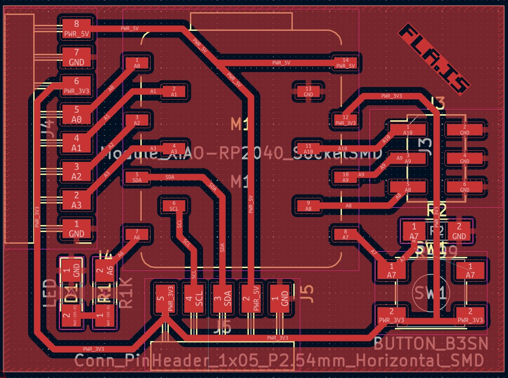

# fla-xiao

KiCad útgáfa af [fabxiao](https://fabacademy.org/2020/labs/leon/students/adrian-torres/fabxiao.html) eftir meistara [Adrián Torres](https://fabacademy.org/2020/labs/leon/students/adrian-torres/index.html).

## Breytingar

- [x] Notast við sökkla fyrir Xiao tölvunar
- [x] Rásum endurrað, hægt að fræsa með 0.4mm bita.
- [x] Íhlutum þjappað aðeins
- [x] .dxf skrá bætt við, hentug fyrir Xtool laser 

## BOM / Íhlutalisti

Hægt að nota 3+4 sökkla fyrir tölvuna eða klippa niður lengri sökkla. 

| Íhlutir               | Magn  |
| ---                   | ---   |
| FR1 bretti            | 1 stk | 
| [ESP32C3](https://www.digikey.fi/en/products/detail/seeed-technology-co-ltd/113991054/16652880) / [RP2040](https://www.digikey.com/en/products/detail/seeed-technology-co-ltd/102010428/14672129) | 1 stk |
| [0Ω](https://www.digikey.com/en/products/detail/yageo/RC1206FR-070RL/5698945) viðnám             | 1 stk |
| [499Ω](https://www.digikey.com/en/products/detail/yageo/RC1206FR-07499RL/728944) viðnám           | 1 stk |
| [1kΩ](https://www.digikey.com/en/products/detail/yageo/RC1206FR-071KL/728387) viðnám            | 1 stk |
| 1026 LED, t.d. [blá](https://www.digikey.com/en/products/detail/nextgen-components/1206BBD8100S01/14318403?s=N4IgjCBcoMwOxVAYygMwIYBsDOBTANCAPZQDaIMATAAwAstEAuoQA4AuUIAymwE4CWAOwDmIAL6EAtLUQgUkDDgLEyIAGwwArJpCMxEkJVVgaagASZcAEzPYAtld1igA)                   | 1 stk |
| [B3SN-takki](https://www.digikey.com/en/products/detail/omron-electronics-inc-emc-div/B3SN-3012/1811776?s=N4IgTCBcDaIM4HcCMSAsYC0A7AJiAugL5A)            | 1 stk |
| [Sökkull 4pos](https://www.digikey.com/en/products/detail/sullins-connector-solutions/NPTC041KFXC-RC/776054)          | 2 stk |
| [Sökkull 3pos](https://www.digikey.com/en/products/detail/sullins-connector-solutions/NPTC031KFXC-RC/776053)          | 2 stk |
| [90° tengi 8 pos](https://www.digikey.com/en/products/detail/samtec-inc/SMH-108-02-G-S/10218741)         | 1 stk |
| [90° tengi 5 pos](https://www.digikey.com/en/products/detail/samtec-inc/SMH-105-02-G-S/10218735) | 1 stk |
| [90° tengi 6 pos](https://www.digikey.com/en/products/detail/gct/BG300-06-A-L-A/9859597) | Hægt að nota í staði 5 pos |
